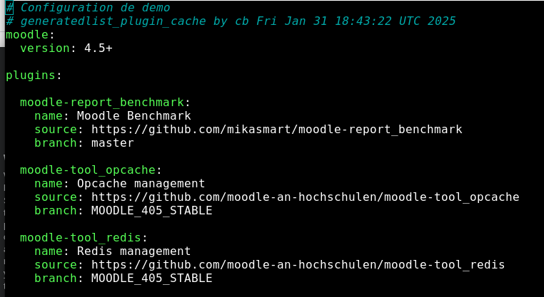

# Edition de la configuration du projet

Lancement du script, sélection du projet, choix de la commande **Edition de la configuration du projet**
Le fichier de configuration du projet s'affiche 

Quand l'administrateur ajoute un plugin au projet, le script met à jour le fichier de configuration.
Les spécifications publiées par Moodle pour le développment de nouveaux plugins ne donnent pas de directives précises pour gérer les versions.
Ce qui fait qu'on peut avoir :
- une seule branche, la version étant gérée (ou pas) dans les meta données du plugin
- une branche par version Moodle
- ...

le script détermine au mieux la branche à utiliser, à charge pour l'administrateur de valider ce choix.

L'éditeur permet d'afficher la configuration du projet en mode édition pour des mise à jour eventuelles: 

- modification de la version d'un plugin
- ajout d'un plugin qui n'est dans le répertoire officiel
- suppression d'un plugin de la base de code
