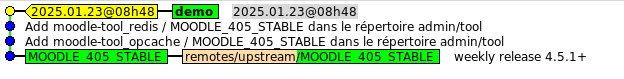

# Les étapes

la génération d'une base de code  est composée de 4 étapes
- 1 Mise à jour du cache local (Moodle, plugins)
- 2 Mise à jour de la configuration 
- 3 Génération d'une base de code à jour 
- 4 livraison d'une nouvelle version 

## 1 Mise à jour du cache local

### 1.1 Moodle

Initialement le dépôt local Moodle est mise à jour lors de la création d'un nouveau projet.

Ensuite le dépôt est mis à jour par le lancement de la commande **Mise à jour du cache Moodle**

Chaque version majeure de Moodle, est associée à une branche du dépôt git.

Les versions 4.5.X sont liées à la branche **MOODLE_405_STABLE**
Cette branche est uniquement mise à jour à partir du dépôt de référence Moodle, et sert de point de départ à la branche du projet.
Moodle publie régulierement des mises à jour:
- toutes les semaines pour des corrections (fixes)
- tous les 2 mois pour une nouvelle version mineure

Cette mise à jour impacte la base de code dans les cas suivants:
- la version MOODLE est de la forme 4.5+
- la version MOODLE est de la forme 4.5.X et il y a eu une nouvelle version mineure

dans les autres cas il n'y a pas d'impact.

### 1.2 Plugins

A partir des information fournies par le répertoire officiel des plugins la commande **Import d'un plugin** met à jour le cache local (clone du dépot git du plugins).

#### 2 Mise à jour de la configuration, intégration

La liste des plugins à intégrer dans la base de code est fournie par le fichier de configuration.

L'état du plugin est donné par les parametres : branch, tag et/ou version
- branch du plugin
- version : branch, tag ou commit 

Il est possible d'intégrer des plugins non officiels en mettant directement à jour le fichier de configuration. 
Dans ce cas il faut préciser :
- source : url du dépot git du plaugin
- version : branch, tag, commit 

nota: dans le cas de l'utilisation de la commande **Import d'un plugin** le fichier de configuration est mis à jour automatiquement.

L'installation d'un plugin consiste à recopier le source dans un répertoire du source Moodle 
L'emplacement est déterminé par le type de plugin obtenu à partir du nom normalisé du plugin **moodle-type_name**
Le type détermine l'emplacement dans le source Moodle, name le nom du repertoire.

La version du plugin dépend de la version Moodle: Moodle n'a pas donné de recommendations, ce qui fait que plusieurs façons de faire existent
Le script détermine au mieux la version: ceci doit etre vérifié et eventuellement corrigé par l'administrateur.

L'administrateur peut ajouter des plugins non "officiels" : il doit préciser alors le source du dépot git, la version utilisée.

De même l'Administrateur peut supprimmer un plugin d'un projet en le supprimant simplement dans le fichier de configuration (il devra aussi penser à le desinstaller dans les environnements où la base de code avait été déployée)

## 3 Générations de la base de code

Chaque instance de code correspond à une branche du dépot Moodle mise à jour lors de l'installation d'un plugin.

Le traitement de re conciliation veille que l'on ait **état demandé** = **état demandé**
Chaque installation de plugin correspondant à un commit.

## 4 Livraison
 
Par rapport à l'étape précédente le script génére une étiquette (tag) qui marque une étape.

Sur cette capture d'écran on voit:
- la branche correspondant au projet (demo) avec une étiquette pour marquer la livraison
- les commits correspondant à l'installation des plugins
- la branche Moodle de départ

Ceci permet de déployer la version de la base de code dans différents environnements : test, staging, prod, ...
En cas de probléme on corrige et on regénère une nouvelle version.
L'utilisation permet de git permet de conserver l'historique des versions t de revenir à un état antérieur.