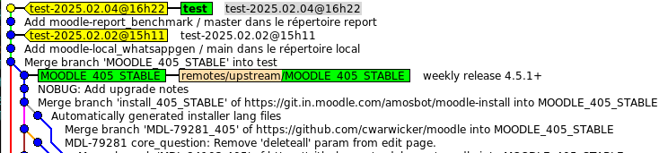

# Livraison

La livraison d'une nouvelle version de la base de code est déclenchée par la commande: **Génération d'une nouvelle version du projet**

Cette commande créer une étiquette (tag) de la forme **nom-du-projet-AAAA-MM-DD@HH:MM:SS** 

Ceci permet de conserver un historique des différentes versions et de revenir à un état antérieur si besoin.

