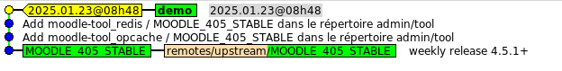

# Création d'un nouveau projet


Nous allons exécuter le scénario suivant :

- création d'une base de code Moodle:
  - Version Moodle 4.5 avec les derniers fixes publiés
  - 2 plugins : moodle-tool_opcache, moodle-tool_redis
- génération de la base de code (build)
- livraison

## Pre requis

L' outil est un script bash qui fonctionne dans un environnement Linux avec les pre requis suivants:
- installation de git pour récupérer les sources de Moodle, des plugins.

```bash

  sudo apt install git

```

- installation du package jq pour lire les fichiers au format json

```bash

  sudo apt install yq

```

- installation de [yq](https://github.com/mikefarah/yq/#install) pour lire le fichier de configuration au format yaml
  sous unbuntu/debian pour installer la derniere version
  
  ```bash

    sudo wget https://github.com/mikefarah/yq/releases/latest/download/yq_linux_amd64 -O /usr/bin/yq
    sudo chmod +x /usr/bin/yq

  ```
## Installation

cloner le dépot dans votre environnement de travail:

```bash

  git clone https://gitbub.com:cbillon/mcm.git
  
```

## Les étapes 

- 1 création d'un nouveau projet  
- 2 Installation des plugins
- 3 Mise à jour de la base de code
- 4 Génération d'une nouvelle livraison
- 5 Mise à jour Moodle


### 1 Création du nouveau projet

Lancer le script :

```
  cd mcm
  ./mcm

```
Nommez le projet par exemple: demo

La création d'un nouveau projet entraine une mise à jour d'un clone du dépot Moodle (cache local)
A chaque projet est associée une base de code.
Le fichier de configuration de la base de code s'affiche:

Il comporte:
- la version source de Moodle 
- la liste des plugins à installer (cette liste est vide au démarrage)

Il est possible de gérer plusieurs projets (multi instances)

#### Version de Moodle

La version Moodle est précisée lors de la création du projet.
L'option définie ici est 4.5+
cela désigne la dernière version 4.5 de Moodle disponible avec les dernières mises à jour hebdomadaires.

Il est possible de définir une version figée : 4.5.1 par exemple.
Les différentes options du fichier de configuration sont détaillées [ici](../reference/conf.md)

### 2 Installation des plugins

2 étapes :
- mettre à jour le dépot des plugins (cache local)
- ajouter le plugin au projet

#### 2.1 Mise à jour du cache des plugins

Choisissez dans le menu **Import d'un plugin**

A partir du nom saisi par l'administrateur l'outil va chercher des informations dans le répertoire officiel des plugins agréés par Moodle.
Le script récupère :

- la description
- la source du dépot git
- la version 

le dépot du plugin est cloné en local (mise à jour du cache local)
Les plugins importés dans le cache en local, sont disponibles pour les diffrents projets.
La version installée dépond de la version Moodle du projet.   
nota : Moodle HQ n'a pas codifié de façon précise comment sont gérées les versions des plugins, ce qui fait qu'il existe différentes pratiques.

Le script propose une version (best effort..), et laisse à l'administrateur la possibilité de corriger cette proposition. 

Le cache Moodle le cache des plugins sont partagés par toutes les instances de base de code (factorisation).

nota : il est possible de choisir un plugin qui n'est pas dans le répertoire officiel en mettant à jour directement le fichier de configuration.

#### 2.2 Mise à jour du fichier de configuration

En lançant la commande : **Ajout d'un plugin au projet**

Le script présente la liste des plugins présents dans le cache, mais non déjà présents dans le fichier de configuration du projet.
L'administrateur sélectionne le (ou les) plugin(s) à installer.

dans le fichier de configuration 2 parametres obligatoires:
- source : url du depôt git du mainteneur
- version : version du plugin à utiliser, doit être compatible avec la version Moodle

La version peut être :
- une branche 
- une étiquette (tag)
- un commit   

C'est cette information qui donne l'état de la ressource, qui sera utilisée dans la boucle de conciliation.

Pour agréer un plugin, Moodle demande au développeur :
- d'indiquer un dépot git (la plupart du temps github)
- d'être compatible avec au moins 1 version Moodle maintenue

Mais n'a pas à préciser ***comment sont gérées les dépendances avec les versions de Moodle***. 

Ce qui fait que plusieurs pratiques co existent :
- une branche unique 
- une branche pour chaque version Moodle
Le script essaie de déterminer la version du plugin compatible avec la version Moodle, mais laisse la possibilité à l'administrateur de modifier cette proposition.

### 3 Mise à jour de la base de code

Pour mettre à jour la base de code, lancer l'option du menu **Mise à jour de la base de code**
Le script effectue le travail de récociliation: **état demandé** vs **état observé**
A l'issue de cette étape les 2 plugins sont installés.
Vous pouvez le vérifier en examinant le dépot Moodle du projet.

### 4 Génération d'une livraison

Pour la dernière étape, lancer l'option du menu **Génération d'une nouvelle livraison du projet**
Chaque livraison crée un nouveau commit avec une étiquette (tag) 

 

Sur la capture d'écran vous pouvez voir:
- le tag identifiant la livraison
- les commits correspondants à l'installation des plugins
- la branche de Moodle de départ du projet

### 5 Mise à jour de Moodle

Moodle publie régulièrement des mises à jour:
- des fixes hedomadaire
- une nouvelle version mineure tous les 2 mois

La publication d'une nouvelle version est précédée du passage d'une série de tests.

Ces mises à jour entrainent (ou non) une mise à jour de la base de code.

Dans le menu, la commande **Mise à jour Moodle** effectue cette opération de reconciliation

dans le détail :
- recherche des dernières mises à jour Moodle
- si cela entraine une mise à jour de la base de code, rebase de la branche projet 

Apres cette opération vous obtenez  une nouvelle livraison.
